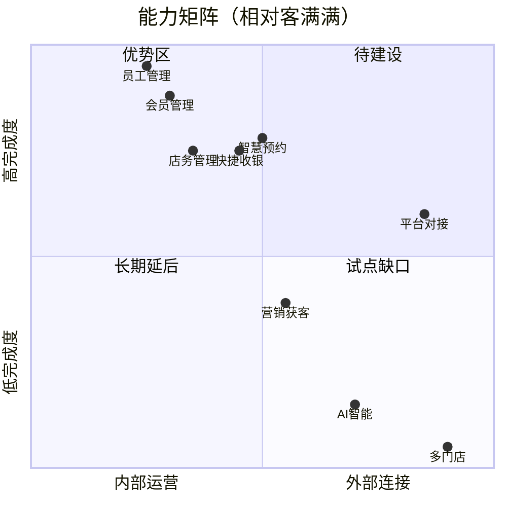
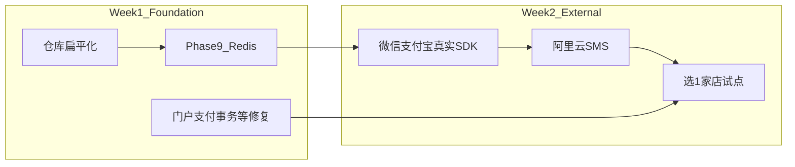

# 美发沙龙管理系统 — 全面诊断与下一步方向

> 生成日期：2026-06-17 · 基于代码库、19 份项目文档、Git 状态与后端扫描

## 文档边界

- 稳定系统契约：见 [`../SPEC.md`](../SPEC.md)，包括技术栈、API 契约、DTO/VO、质量规则、验证标准。
- 当前执行清单：见 [`../TODO.md`](../TODO.md)，只放可勾选的近期任务。
- 单功能产品需求：见 [`prd/`](prd/)，大功能先写 PRD，再拆到 TODO。
- 本文档只维护整体诊断、优先级、路线图和阶段性方向，不复制稳定规范和详细执行清单。

## 一、项目现状一句话

这是一个**功能覆盖面较广的单店 SaaS 原型**：31 个后端模块、43 个前端页面、7 大业务闭环中 6 个已闭合，对标客满满加权完成度约 **73%**。代码层经过大规模商用审计（281/297 项已修复），**内部店务/会员/收银/预约逻辑可支撑试点**；短板集中在 **外部生态（微信/支付宝/SMS/小程序）**、**营销玩法**、**生产级中间件** 和 **仓库/Git 健康度**。



---

## 二、当前可能存在的问题（按严重度）

### P0 — 会直接影响开发/部署/上线

#### 1. Git 仓库扁平化迁移已完成（2026-06-17）

- **处理结果**：已新建干净 GitHub 远程 [`zhou23378/MyFirstAiProject`](https://github.com/zhou23378/MyFirstAiProject)，以根目录结构完成 initial commit 并推送到 `main`。
- **旧仓库处理**：旧 Gitee Git 元数据已本地归档到 `.git-old-gitee-20260617`，并被 `.gitignore` 排除；不再向旧远程推送。
- **配置策略**：[`application-prod.yml`](../backend/src/main/resources/application-prod.yml) 作为可复现生产 profile 模板提交，敏感值全部来自环境变量。
- **数据策略**：`db/*.sql` 已被 `.gitignore` 排除，新增 [`db/README.md`](../db/README.md) 说明原始 SQL 导出仅限本地，`salon_data_only.sql` 含 audit_log 登录请求参数、测试密码、手机号和短信验证码，不得提交。
- **CI 策略**：GitHub Actions 后端已从 `mvn compile` 升级为 `mvn test`，前端保留 `npm run build`；Docker smoke 收窄为 `mysql + backend + frontend` 核心链路，AI 镜像单独验证，避免模型下载网络波动阻塞基础 CI。

#### 2. 真实支付 / SMS 仍是 Mock，无法商用收款

- 支付网关接口已抽象（[`payment/`](../backend/src/main/java/com/salon/payment/)），但 WeChat/Alipay SDK 在 [`pom.xml`](../backend/pom.xml) 中 **注释掉**（Maven GAV 问题 + 缺商户资质）。
- SMS 使用 Aliyun SDK 骨架，缺 AccessKey + 模板审核。
- **影响**：消费→支付→对账闭环在逻辑上闭合，但 **无法产生真实资金流**；营销自动化（生日券、预约提醒）依赖 Mock SMS。

#### 3. 生产架构 Phase 9（Redis）未启动

文档 [`docs/12`](12-商用代码审计未修复项-2026-05-22.md) §九 列出的 10 项架构差距中，**Redis 是唯一 P0 上线阻断项**：

| 能力 | 当前实现 | 多实例/高并发风险 |
|------|----------|-------------------|
| 分布式锁 | MySQL `GET_LOCK` | 无 watchdog，DB 压力大 |
| 限流 | 内存 `ConcurrentHashMap` | 重启丢失；多实例不共享 |
| 支付回调幂等 | DB 查重 | 高并发下需 Redis 去重 |
| 缓存 | 每次查 DB | 性能瓶颈 |

Phase 10（连接池/线程池/优雅停机）已完成；Phase 11–13（MQ/监控/多实例）待功能冻结后做。

---

### P1 — 代码层剩余风险（扫描验证，非文档过时）

大规模审计后核心路径已加固，但 **2026 年实时扫描** 仍发现以下集中隐患：

| 问题 | 位置 | 风险 |
|------|------|------|
| Controller 返回 Entity | [`BirthdayConfigController.java`](../backend/src/main/java/com/salon/marketing/controller/BirthdayConfigController.java) | 违反 DTO/VO 契约 |
| 多表写无 `@Transactional`，且扣款后流水 rows 未检查 | [`CustomerPortalController.pay()`](../backend/src/main/java/com/salon/customer/controller/CustomerPortalController.java) | 余额扣减与流水可能不一致；同流程 `jdbcTemplate.update` 后再 `selectById` 也违反缓存安全规则 |
| 未检查 `jdbcTemplate.update` rows | `NotificationController`、`GroupBuyOrderServiceImpl` 等 ~10 处 | 静默失败 |
| 定时任务无分布式锁 | [`GroupBuyExpiryScheduler`](../backend/src/main/java/com/salon/groupbuy/scheduler/GroupBuyExpiryScheduler.java) | 多实例可能重复退款 |
| 审计日志脱敏不足 | [`AuditLogAspect.java`](../backend/src/main/java/com/salon/audit/aspect/AuditLogAspect.java) | 当前运行时主要脱敏手机号，`password/token/secret` 等字段仍可能进入审计日志 |
| 员工状态变更 check-then-act | [`EmployeeController`](../backend/src/main/java/com/salon/employee/controller/EmployeeController.java) | 低并发下可接受，非资金路径 |

**对比**：订单/预约/库存/优惠券过期等 **资金与状态主路径** 已普遍使用原子 SQL + 状态守卫 + `@Transactional`。

---

### P2 — 产品与体验差距

#### 预约模块 — 日历看板主体已落地，待验收补齐

复核代码后，`docs/20` 中的 P0 看板主体已经进入代码库：[`AppointmentController`](../backend/src/main/java/com/salon/appointment/controller/AppointmentController.java) 已有 `/api/appointment/calendar/day|week`，前端 [`CalendarBoard.vue`](../frontend/src/views/appointment/components/CalendarBoard.vue)、[`DayView.vue`](../frontend/src/views/appointment/components/DayView.vue)、[`WeekView.vue`](../frontend/src/views/appointment/components/WeekView.vue) 已接入 [`appointment/index.vue`](../frontend/src/views/appointment/index.vue)。

下一步不应再写成“从零实现预约日历”，而应改为 **验收与补齐**：

- 跑浏览器端验收：日视图/周视图/点击空白格建预约/详情抽屉/状态流转
- 补移动端适配、空态/错误态、未分配预约展示、业务时间配置透出
- 评估 P1 交互：拖拽改期、冲突可视化、批量筛选与打印

#### 营销域最弱（39%）

缺：秒杀/限时促销、裂变、微信模板消息、电子会员卡等。近期已补：积分商城、拼团、佣金、生日/R/标签 — 但 **获客与促活玩法** 仍远落后于客满满。

#### 前端工程化薄弱

- **零前端单元测试**（grep 无 `describe`/`test`）
- 部分资金页面缺防重复提交（文档 [`docs/13`](13-已知问题与技术债务.md) 标注待验证）
- UI polish 项（Cmd+K、暗色模式、WebSocket 仪表盘）均为 P3

#### 测试覆盖不对称

- 后端已有核心测试文件（支付、拼团、充值、通知等），但覆盖仍集中在少数新模块
- CI 已升级为 `mvn test` + `npm run build` + 核心 Docker smoke；但覆盖仍集中在少数新模块，AI Docker 镜像需单独验证
- 无 E2E、无负载测试（排队并发未验证）

---

### P3 — 文档与阶段命名混乱（治理问题，非功能 bug）

存在 **两套 Phase 编号** 容易误导后续 AI/开发者：

| 来源 | Phase 9 含义 | Phase 10 含义 |
|------|-------------|----------------|
| [`_startup.md`](../_startup.md) | AI 应用层 | 测试+优化 |
| [`docs/10/12/13`](10-开发策略与优先级.md) | Redis 生产化 | 连接池（已完成） |

[`_startup.md`](../_startup.md) 仍写「整体 65%」，而 [`docs/11`](11-需求规划-客满满参考.md) 已更新到 **73%**。需要在下次文档同步时统一口径。

---

## 三、项目优势（应保留的方向）

1. **架构清晰**：Java BFF + Python AI + HTTP 桥梁（[`docs/17`](17-AI集成技术方案.md)），ChromaDB 语义搜索已通。
2. **商用编码规范成熟**：[`CLAUDE.md`](../CLAUDE.md) / [`AGENTS.md`](../AGENTS.md) + docs/01 形成可复制的 AI 开发门禁（frontend-first、DTO/VO、23 项自检）。
3. **单店核心闭环完整**：会员生命周期、消费支付对账（Mock）、技师排队计时、库存进出、日结对账。
4. **容器化就绪**：[`docker-compose.yml`](../docker-compose.yml) 四服务（MySQL/Backend/Frontend/AI），[`docs/15`](15-部署与运维手册.md) 有迁移方案。
5. **H5 顾客端已验证**：独立 auth、预约、充值、拼团、积分商城 — 为后续小程序提供业务验证基础。

---

## 四、建议的开展方向（路线图）

### 轨道 A：工程健康（已完成基础项，剩余文档口径同步）

**目标**：让「clone → CI → docker compose up」与文档一致。

1. ~~完成仓库扁平化单次 commit（含根级 [`.github/workflows/ci.yml`](../.github/workflows/ci.yml)）~~
2. ~~`.gitignore` 永久排除 JDK、设计参考包、本地 `chroma_db/`、`.env`；但不要忽略可提交的 `application-prod.yml` 模板~~
3. ~~脱敏或排除 `db/` 中带真实/测试密码和审计请求参数的数据导出~~
4. ~~CI 增强：`mvn test` + 可选轻量 smoke~~
5. 统一 `_startup.md` 与 docs/11 的进度数字和 Phase 命名

---

### 轨道 B：试点上线最小集（1–2 周，商业验证）

**目标**：单店真实运营，不追求功能广度。



| 优先级 | 工作项 | 理由 |
|--------|--------|------|
| P0 | Redis（锁/限流/缓存/幂等） | 上线前硬门槛 |
| P0 | 商户资质 + 真实支付 SDK 接入 | 唯一商业化阻断 |
| P0 | 阿里云 SMS + 预约提醒 | 闭环营销触达 |
| P1 | 修复 `CustomerPortalController.pay` 事务/流水 rows 检查 + `GroupBuyExpiryScheduler` 锁 + 审计日志敏感字段脱敏 | 试点资金安全与日志安全 |
| P1 | 资金页面前端防重复提交 | 用户体验 + 防双扣 |

**刻意不做（试点阶段）**：多门店、小程序、秒杀裂变、Meituan 对接。

---

### 轨道 C：产品体验提升（2–4 周，提升日常使用率）

**目标**：补齐「前台每天打开最多」的页面。

1. **预约日历看板验收与补齐**（[`docs/20`](20-预约日历看板需求文档.md) P0 主体已落地）：浏览器验收 + 移动端/空态/未分配预约 + P1 拖拽/冲突可视化评估 — 预期预约域从 78% → 90%+
2. **报表/仪表盘 WebSocket 或短轮询优化**（可选 P2）
3. **前端 polish 一轮**（可复用 `frontend-polish` skill）：空态/载态/移动端 H5 细节

---

### 轨道 D：AI 应用层（3–4 周，差异化但非上线阻断）

按 [`docs/17`](17-AI集成技术方案.md) 顺序：

| 能力 | Python 端点 | 业务价值 |
|------|-------------|----------|
| 已完成 | `/api/ai/search` 语义搜索 | 会员/服务模糊查找 |
| 下一步 | `/api/ai/predict` XGBoost 流失预测 | 会员详情页「流失风险」标签 |
| 随后 | `/api/ai/recommend` 协同过滤 | 收银/预约推荐服务 |
| 长期 | `/api/ai/query` Text-to-SQL | 店长自然语言查报表 |

**注意**：AI 在 docs/11 权重仅 1%，对标完成度 15% — **适合试点后做差异化**，不应排在 Redis/真实支付之前。

---

### 轨道 E：竞品追赶（1–3 月，按数据决策）

| 领域 | 代表功能 | 预估成本 | 触发条件 |
|------|----------|----------|----------|
| 微信生态 | 小程序（40–60 天） | 高 | H5 试点验证 UX 后 |
| 营销 | 秒杀 D6、模板消息 D8 | 中 | 试点店有促活需求 |
| 平台 | Meituan 预约同步 J3 | 高 | 有美团商户号 |
| 基础设施 | RabbitMQ Phase 11 | 3–5 天 | DAU>100 或 SMS 阻塞主流程 |
| 多门店 | 0% 故意延后 | 很高 | 单店模型跑通后 |

---

## 五、推荐决策：接下来 4 周怎么排

若目标是 **「尽快给真实理发店用」**：

```
Week 1: 轨道 A（Git/CI） + 轨道 B 代码修复 + Redis 接入
Week 2: 真实支付 + SMS + 试点部署 + docs/14 功能测试走一遍
Week 3: 轨道 C 预约日历看板验收补齐 + 高频前台体验优化
Week 4: 试点反馈迭代 + 可选 AI 流失预测 MVP
```

若目标是 **「继续扩功能、暂不上线」**：

```
优先: 预约日历看板验收补齐 → 营销秒杀/拼团增强 → AI 应用层
延后: Redis/真实 SDK（接受 Mock 环境限制）
```

若目标是 **「Portfolio / 演示」**：

```
Docker Demo + 预约看板 UI + AI 搜索/推荐演示
Mock 支付可接受；重点打磨仪表盘与 H5 体验
```

---

## 六、关键文件索引

| 用途 | 文件 |
|------|------|
| 会话入口/阶段 | [`_startup.md`](../_startup.md) |
| 竞品差距矩阵 | [`docs/11-需求规划-客满满参考.md`](11-需求规划-客满满参考.md) |
| 中间件决策 | [`docs/10-开发策略与优先级.md`](10-开发策略与优先级.md) §八 |
| 未修复项/生产差距 | [`docs/12`](12-商用代码审计未修复项-2026-05-22.md) · [`docs/13`](13-已知问题与技术债务.md) |
| AI 路线 | [`docs/17-AI集成技术方案.md`](17-AI集成技术方案.md) |
| 下一 UX 大项 | [`docs/20-预约日历看板需求文档.md`](20-预约日历看板需求文档.md) |
| 功能测试清单 | [`docs/14-功能测试目录.md`](14-功能测试目录.md) |

---

## 七、结论

**项目不是「半成品 demo」，而是「单店内部运营已接近商用、外部对接与生产架构未完成」的过渡态。**

- **最大工程风险**：Git 扁平化未完成 — 应先于任何功能开发
- **最大商业风险**：Mock 支付/SMS — 无法真实收款和触达客户
- **最大产品差距**：营销（39%）+ 微信生态；**最高频 UX 补齐项**是预约日历看板验收与 P1 体验完善
- **最大架构债务**：Redis 未接入 — 单实例可跑，上线/扩容必做
- **代码质量**：主路径已商用级；剩余 ~10 处 jdbcTemplate/事务问题集中在 H5 门户、拼团、通知等较新模块

**默认推荐路径**：先 **轨道 A + B（工程健康 + 试点上线集）**，并行做 **预约日历看板验收补齐（轨道 C）** 作为产品侧最高 ROI 功能；AI 应用层在试点有数据后再做流失预测 MVP。

---

## 附录：待办清单

| ID | 工作项 | 优先级 |
|----|--------|--------|
| git-flatten | 已完成：新 GitHub 远程 initial clean baseline，旧 Gitee 元数据本地归档 | Done |
| prod-config-track | 已完成：保留可提交的 `application-prod.yml` 模板，敏感值来自环境变量 | Done |
| data-sanitization | 已完成：`db/*.sql` 排除提交，新增 `db/README.md` 标记原始导出敏感 | Done |
| ci-run-tests | 已完成：CI 后端从 `mvn compile` 升级为 `mvn test`，前端保留 `npm run build`，Docker smoke 验证核心链路 `mysql + backend + frontend` | Done |
| redis-phase9 | 上线前接入 Redis：分布式锁、限流、缓存、支付幂等（docs/12 Phase 9） | P0 |
| real-pay-sms | 申请商户资质并接入真实微信/支付宝 SDK + 阿里云 SMS | P0 |
| code-hotfixes | 修复扫描发现的隐患：CustomerPortalController.pay 事务/流水 rows、GroupBuyExpiryScheduler 锁、BirthdayConfigController VO | P1 |
| audit-log-mask | 审计日志运行时补充 password/token/secret 等字段级脱敏，避免新日志继续记录敏感参数 | P1 |
| appointment-calendar-acceptance | 预约日历看板主体已落地：按 docs/20 做浏览器验收，补移动端/空态/未分配预约/P1 冲突可视化 | P1 |
| ai-predict-mvp | 试点有数据后：Phase 9 AI 流失预测 MVP（/api/ai/predict + 前端标签） | P2 |
| doc-sync | 统一 _startup.md 与 docs/11 进度口径，区分「功能 Phase」与「生产 Phase」命名 | P2 |
